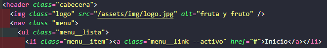
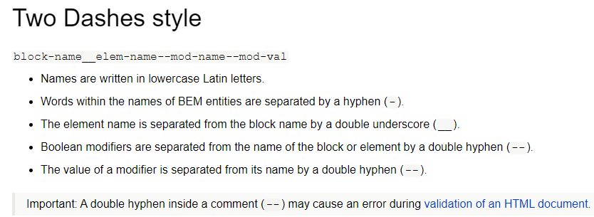
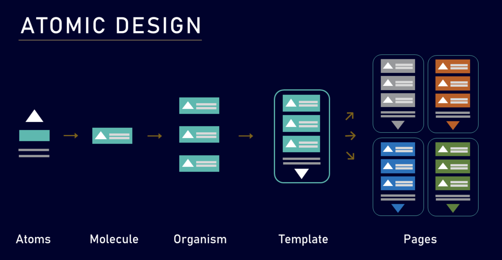
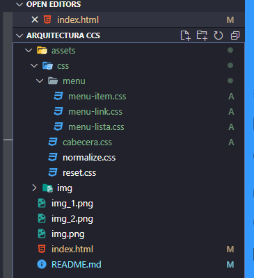

# Arquitectura-css

## Conceptos básicos

### Que es?

Es una metodología que se enfoca en la estructura de un proyecto.

### Objetivos de un arquitectura css

Es la organización del código y carpetas junto a una metodología de clases para que el trabajo en equipo esté estandarizado.

### Una arquitectura CSS debe ser

#### **Predecible**

* Sus reglas hacen lo que se espera. Y que al añadir o actualizar una regla, no tiene repercusiones inesperadas.

#### **Reutilizable**

* Las reglas son abstractas y están desacopladas. Así se podrán crear nuevos componentes de una forma rápida y muchísimo más sencilla.

#### **Mantenible**

* Que es la capacidad de realizar cambios dentro de nuestro CSS sin necesidad de tener que refactorizar todo el código que ya existe.

#### **Escalable**

* Significa que a medida que nuestro CSS va creciendo, sigue siendo fácil de mantener.

*¿qué tipos de metodologías existen?*

*Las más populares son OOCSS, SMACSS, BEM, ITCSS y ACSS, también conocida como atomic design. Y para este curso vamos a estar trabajando con la metodología BEM para nombrar las clases y con el atomic design, para lo que sería la estructuración de todo nuestro proyecto.*

## Metodología BEM
https://en.bem.info/methodology/

**Es una convención de nomenclatura popular para clase en HTML y CSS.**

La idea detrás de esto es dividir la interfaz de usuario en bloque independientes. Esto hace que el desarrollo de estas 
interfaces sea fácil y rápido, incluso cuando estamos trabajando con interfaces de usuario muy complejas. 
También permite crear componentes de interfaz extensibles y reutilizables.

*¿Y cuál es el objetivo principal de esta metodología BEM?* Es dar significado al nombre de las clases. Es un 
significado más informativo a las clases para que los desarrolladores puedan entender y puedan también comprender mejor
lo que es el HTML y el CSS en un proyecto determinado.

**Un bloque** es un componente de página funcionalmente independiente que se puede reutilizar. En HTML, los bloques 
están representados por el class atributos y los bloques son considerados como los padres. Entonces si vemos aquí en 
nuestro ejemplo tenemos un `div class = “card”`. Ese sería un bloque. Ese div, con esa clase card dentro de la metodología BEM.

**Los elementos** que son una parte compuesta de un bloque que no se puede usar por separado, tenemos un 
`form class = “contacto”` y dentro de ese form tenemos un input y un botón. Si ven aquí la class “contacto” 
sería nuestro bloque y este `input class=”contacto”` `__input` es nuestro elemento. `“contacto__button”` sería el 
segundo elemento dentro de nuestro bloque.

 **Los modificadores** son entidades que definen la apariencia, el estado o el comportamiento de un bloque o elemento.
Se representa en la metodología BEM con dos guiones seguidos y el nombre de nuestro modificador. `--resaltar`

## Atomic design

El átomo es el componente más pequeño, luego vienen las moléculas que están conformadas por un grupo de átomos. 
Luego vienen los organismos que son un grupo de moléculas y sucesivamente templates y páginas. 

**Los átomos** son los componentes básicos de la materia. En la interfaces son nuestras etiquetas HTML.
Ejemplo: cada etiqueta `input` `button` 

**Las moléculas** son grupos de átomos unidos entre sí. Son las unidades fundamentales más pequeñas de un compuesto

**Los organismos** que son grupos de moléculas unidas para formar una sección distinta y relativamente compleja de una interfaz.

**Los templates o plantillas**, que consisten principalmente en grupos de organismos unidos para formar páginas.

**Páginas** Este es el último nivel del Atomic Design. Son en realidad el diseño final que ya contiene las imágenes y otros detalles
que hacen que ese archivo ya esté listo para el desarrollo o, en su defecto, test con usuarios o el equipo.

Como ejemplo la profesora creo archivos atómicos de Css para el menu.

.

